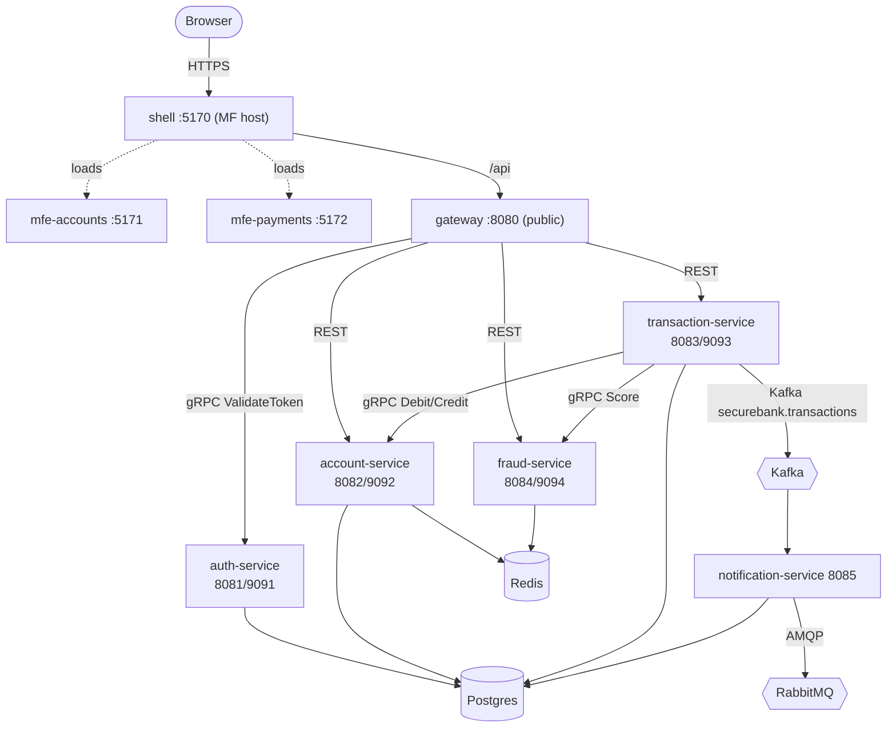

# SecureBank — Platform

> The deployment & documentation hub that ties the whole **SecureBank microservices**
> platform together: the full `docker-compose` mesh, Kubernetes manifests, an
> observability stack, and the system-level docs. This repo builds and runs *every*
> other `securebank-*` repo as one system.

The single source of truth for names/ports/contracts is
[`../MICROSERVICES_SPEC.md`](../MICROSERVICES_SPEC.md).

---

## The org of repos

| Repo | Role | Public? | Ports (http / grpc) |
|---|---|---|---|
| [`securebank-contracts`](../securebank-contracts) | Protobuf contracts → stub jar (gRPC source of truth) | no | — |
| [`securebank-gateway`](../securebank-gateway) | Spring Cloud Gateway — the single public REST entrypoint | **yes** | 8080 / — |
| [`securebank-auth-service`](../securebank-auth-service) | Identity & JWT; gRPC `ValidateToken` / `GetUser` | no | 8081 / 9091 |
| [`securebank-account-service`](../securebank-account-service) | Owns balances; locked gRPC `Debit`/`Credit` | no | 8082 / 9092 |
| [`securebank-transaction-service`](../securebank-transaction-service) | Transfer **saga orchestrator**; Kafka producer | no | 8083 / 9093 |
| [`securebank-fraud-service`](../securebank-fraud-service) | AI fraud scoring + assistant/insights (gRPC) | no | 8084 / 9094 |
| [`securebank-notification-service`](../securebank-notification-service) | Kafka → RabbitMQ notification delivery | no | 8085 / — |
| [`securebank-shell`](../securebank-shell) | Module Federation **host** (routing, auth, i18n) | **yes** | 5170 |
| [`securebank-mfe-accounts`](../securebank-mfe-accounts) | MF **remote** — Dashboard + Accounts | **yes** | 5171 |
| [`securebank-mfe-payments`](../securebank-mfe-payments) | MF **remote** — Transfer + Beneficiaries | **yes** | 5172 |
| **`securebank-platform`** (this repo) | docker-compose, k8s, observability, docs | — | — |

---

## Architecture at a glance



- **gRPC** = synchronous inter-service calls · **Kafka** = domain events ·
  **RabbitMQ** = notification delivery.
- **Only the gateway + frontends are public.** Services are cluster-internal.
- **Database-per-service.** See [`docs/ARCHITECTURE.md`](docs/ARCHITECTURE.md).

---

## Quick start (Docker)

```bash
cd securebank-platform
cp .env.example .env                  # set SECUREBANK_JWT_SECRET (openssl rand -base64 48)
docker compose up -d --build          # full mesh
docker compose --profile observability up -d   # + Kafka UI / Prometheus / Grafana
```

Then open **http://localhost:5170** (the app). Full runbook + curl walkthrough:
[`docs/running-locally.md`](docs/running-locally.md).

Kubernetes instead? [`docs/kubernetes-guide.md`](docs/kubernetes-guide.md):

```bash
kubectl apply -k k8s/overlays/dev
```

---

## Ports

| Service | HTTP | gRPC | Service | Port |
|---|---|---|---|---|
| gateway (public) | 8080 | — | postgres | 5432 |
| auth-service | 8081 | 9091 | redis | 6379 |
| account-service | 8082 | 9092 | kafka (internal `kafka:29092`, host) | 29092 |
| transaction-service | 8083 | 9093 | rabbitmq (amqp / mgmt) | 5672 / 15672 |
| fraud-service | 8084 | 9094 | kafka-ui (obs) | 8090 |
| notification-service | 8085 | — | prometheus / grafana (obs) | 9090 / 3000 |
| shell | 5170 | — | mfe-accounts / mfe-payments | 5171 / 5172 |

> gRPC ports (9091–9094) are internal-only and not published by compose. Kafka uses
> 29092 to stay clear of the gRPC 909x range (spec §8).

---

## Demo credentials

Both passwords are **`Password123!`** (seeded by auth-service):

| Username | Password | Role |
|---|---|---|
| `admin` | `Password123!` | ADMIN |
| `jsmith` | `Password123!` | CUSTOMER |

---

## Documentation

| Doc | What's in it |
|---|---|
| [ARCHITECTURE.md](docs/ARCHITECTURE.md) | Topology, C4 diagrams, the 3 comms boundaries, database-per-service, request path |
| [money-transfer-flow.md](docs/money-transfer-flow.md) | **Flagship** transfer saga + compensation sequence diagrams |
| [grpc-guide.md](docs/grpc-guide.md) | Contracts, ports, net.devh wiring, `grpcurl` testing, TLS/mTLS |
| [micro-frontends.md](docs/micro-frontends.md) | Module Federation host/remote, shared singletons, independent deploy |
| [running-locally.md](docs/running-locally.md) | **The runbook** — up, URLs, creds, curl walkthrough, troubleshooting |
| [kafka-guide.md](docs/kafka-guide.md) | Topics, listeners, the Zookeeper `ruok` bug, ops, Strimzi |
| [redis-guide.md](docs/redis-guide.md) | Distributed locks + cache, the 3-tier lock, ops |
| [rabbitmq-guide.md](docs/rabbitmq-guide.md) | Exchange/queue/binding, why Rabbit vs Kafka, ops |
| [kubernetes-guide.md](docs/kubernetes-guide.md) | kind/minikube, apply overlay, port-forward, scale, HPA |
| [cicd.md](docs/cicd.md) | Per-repo CI + independent deploys; this repo validates the glue |
| [deployment-topology.md](docs/deployment-topology.md) | Production deployment diagram + scaling profile |
| [design-patterns.md](docs/design-patterns.md) | System patterns: gateway, saga, DB-per-service, CQRS-lite, breaker, strategy/adapter, idempotency, 3 locks |

---

## Repo layout

```
securebank-platform/
├── docker-compose.yml          # full mesh + observability profile
├── .env.example
├── postgres-init/              # creates the auth + securebank databases
├── observability/              # prometheus.yml + grafana provisioning
├── k8s/
│   ├── base/                   # namespace, config, secret, infra, services, ingress, hpa
│   └── overlays/{dev,prod}/    # kustomize overlays
├── docs/                       # everything in the table above
└── .github/workflows/ci.yml    # validates compose + kustomize
```

---

## Notes & caveats

- The `.env` JWT secret is **required** — auth-service refuses to start without it.
- `k8s/base/secret.yaml` ships **plaintext placeholders** for demo convenience; use
  **Sealed Secrets / Vault** for anything shared (see the kubernetes guide).
- In-cluster Postgres/Kafka/Redis/RabbitMQ are for dev/demo parity; prefer managed
  services or operators (CloudNativePG, Strimzi, RabbitMQ operator) in production.
- Each **service** repo builds and publishes its own image in its own CI; this repo
  does not build the services, only validates the deployment glue.
