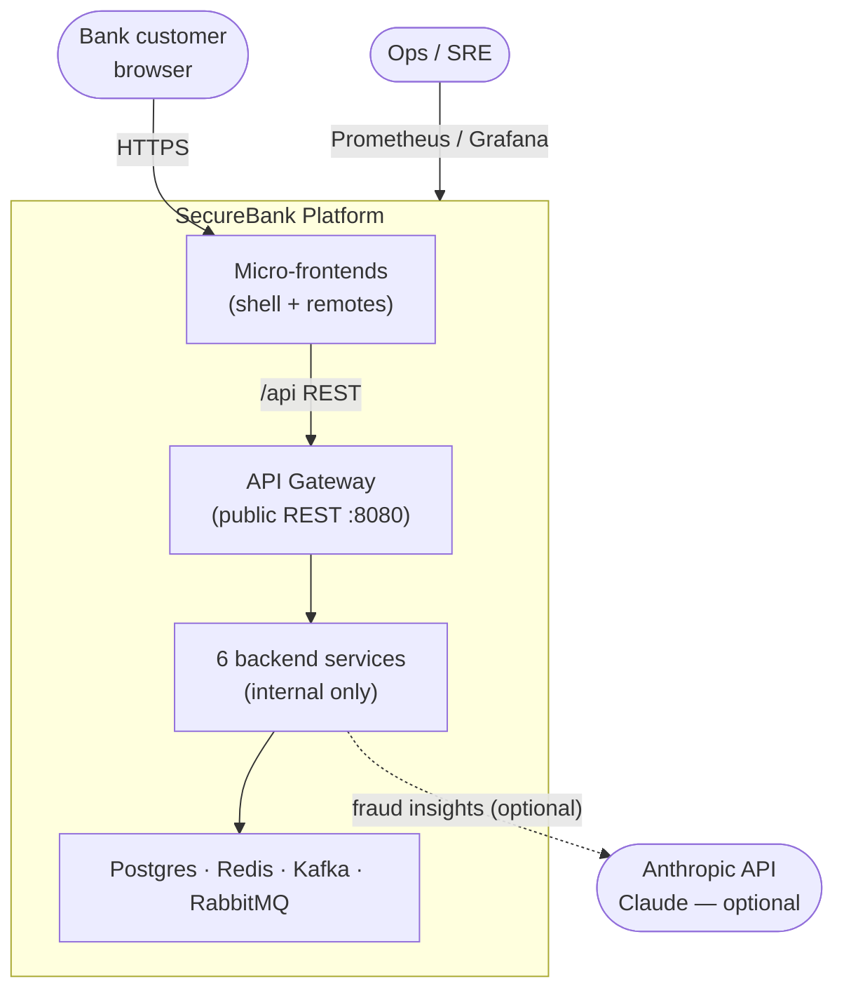
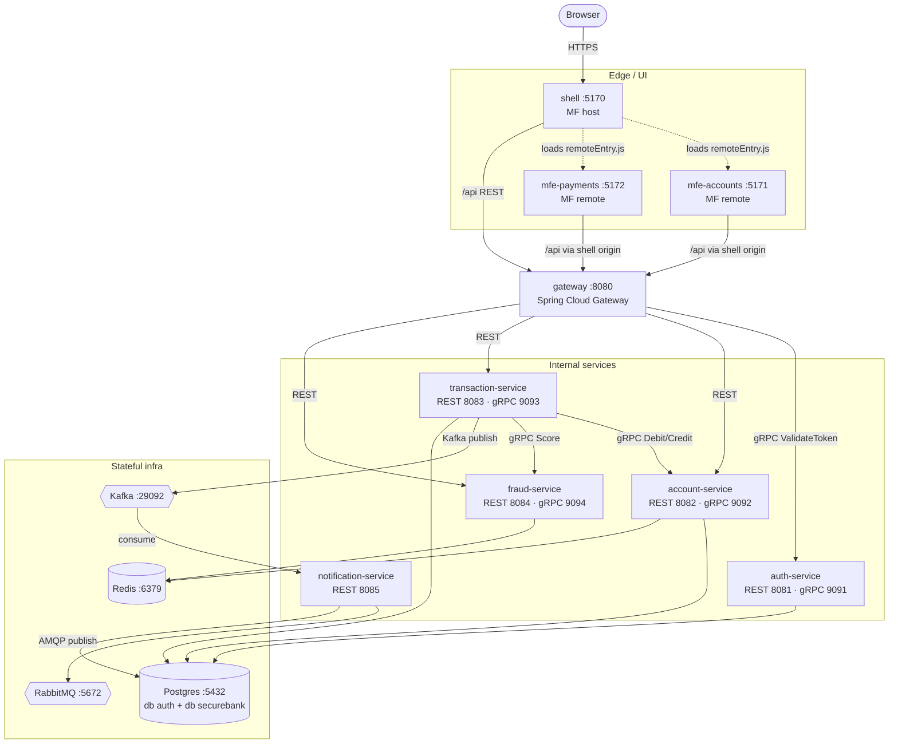
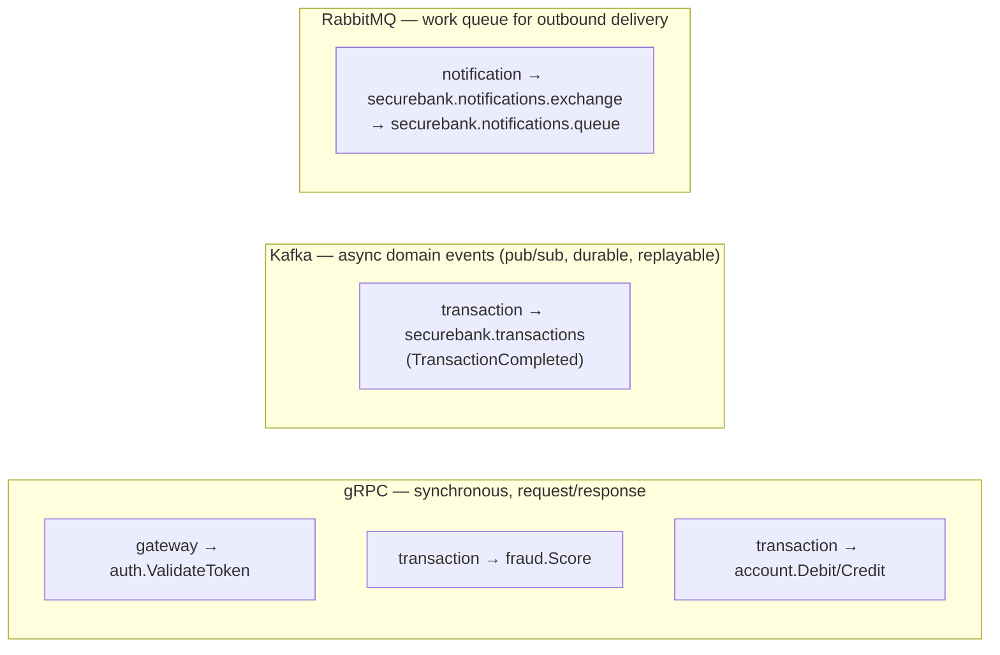
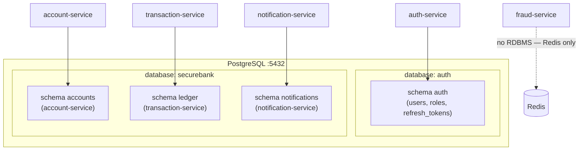
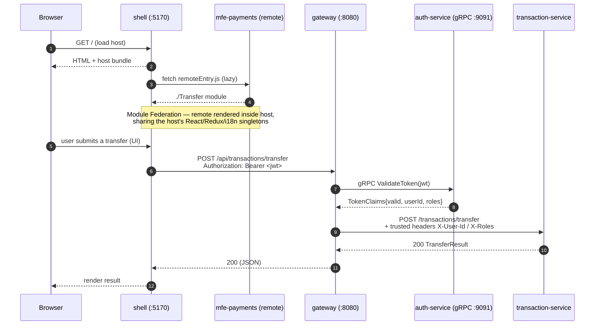

# SecureBank — System Architecture

> The microservices edition. This document is the system-level companion to
> [`MICROSERVICES_SPEC.md`](../../MICROSERVICES_SPEC.md). It describes the topology,
> the three communication boundaries (gRPC / Kafka / RabbitMQ), the
> database-per-service model, and the request path from the browser to the services.

---

## 1. Context (C4 level 1)

Key rules (from the spec):

- **Only the gateway is publicly reachable.** Every other service is cluster-internal.
- **Synchronous inter-service calls use gRPC** (Protobuf contracts in `securebank-contracts`).
- **Asynchronous eventing uses Kafka** (domain events) and **RabbitMQ** (notification delivery).
- **Database-per-service**: each service owns its schema; no cross-service DB access.

---

## 2. Container diagram (C4 level 2)

---

## 3. The three communication boundaries

SecureBank deliberately uses **three different transports**, each chosen for a reason:

| Transport | When it is used | Why this transport |
|---|---|---|
| **gRPC** | In-band calls a request **must wait on**: token validation, fraud scoring, balance debit/credit. | Strongly-typed Protobuf contracts, low latency, HTTP/2 multiplexing, generated stubs. A transfer cannot proceed without these answers, so they are synchronous. |
| **Kafka** | Broadcasting a fact that **already happened** (`TransactionCompleted`). | Durable, replayable, multi-consumer log. The transaction succeeds whether or not anyone is listening; new consumers (analytics, audit) can be added without touching the producer. |
| **RabbitMQ** | The notification-service's **outbound delivery** work queue. | Per-message routing/acking semantics of a classic work queue fit "deliver this one notification" better than a replayable log. Keeps delivery retries/DLQ separate from the domain event stream. |

> **Boundary rule:** a transfer is *consistent* via the synchronous gRPC saga; the
> *notification* is eventually-consistent via Kafka→Rabbit. A slow or down
> notification path never blocks or fails a transfer.

---

## 4. Database-per-service

- **auth-service** owns its **own physical database `auth`** (login role `auth`).
- **account / transaction / notification** share the physical database `securebank`
  but each owns a **separate schema** (`accounts`, `ledger`, `notifications`) created
  and migrated by **its own Flyway**. A service never reads another service's tables.
- **fraud-service** has **no relational store** — it uses Redis only.

> Physically co-locating three schemas in one Postgres instance is a pragmatic
> dev/demo choice; the *logical* boundary (separate schema, separate owner, separate
> Flyway, no cross-schema queries) is what makes it "database-per-service". In prod
> you can split each schema onto its own managed instance with zero code change —
> only the datasource URL moves.

The init script that creates the `auth` + `securebank` databases is
[`postgres-init/01-init-databases.sql`](../postgres-init/01-init-databases.sql); the
schemas themselves are created by each service's Flyway (`create-schemas: true`).

---

## 5. Request path: browser → shell → gateway → services

The gateway is the **trusted internal authority boundary**: it validates the JWT once
(via gRPC to auth-service) and forwards a small trusted claims set (`X-User-Id`,
`X-Roles`) on the internal network, so downstream services never re-parse JWTs.

---

## 6. The flagship flow — see the dedicated diagram

The money-transfer saga (the heart of the platform) — crossing the gateway,
transaction-service, fraud + account over gRPC, Kafka, notification-service and
RabbitMQ, **including the compensation path** — has its own document:

➡️ [`money-transfer-flow.md`](./money-transfer-flow.md)

---

## 7. Cross-cutting concerns

| Concern | Where | How |
|---|---|---|
| AuthN/Z | gateway + auth-service | JWT issued by auth (REST); validated centrally by gateway (gRPC `ValidateToken`); trusted headers downstream. |
| Resilience | gateway, transaction, fraud | Resilience4j circuit breakers + retries on gRPC/HTTP calls; saga compensation in transaction-service. |
| Idempotency | account-service | `Debit`/`Credit` are idempotent on `transaction_ref` so saga retries don't double-apply. |
| Locking | account-service | Pessimistic row lock + JPA `@Version` + Redis distributed lock around balance mutation. |
| Observability | all services | Micrometer → `/actuator/prometheus`; Prometheus scrape + Grafana (observability profile). |
| i18n | shell + remotes + notification-service | react-i18next (en/hi/mr) on the UI; localized message bundles on notification-service. |

See [`design-patterns.md`](./design-patterns.md) for the full pattern catalogue and
where each is applied.
