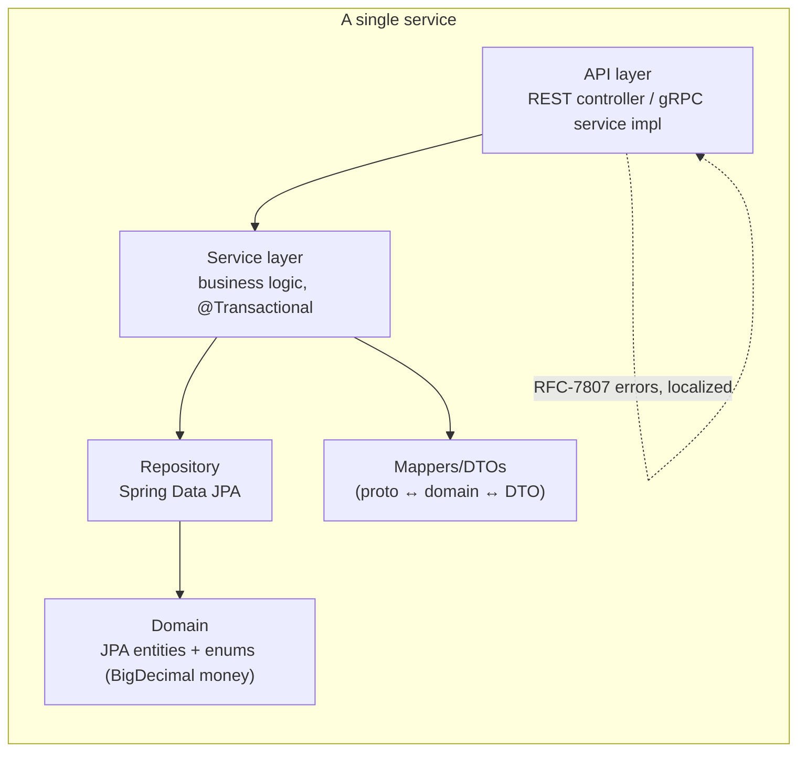
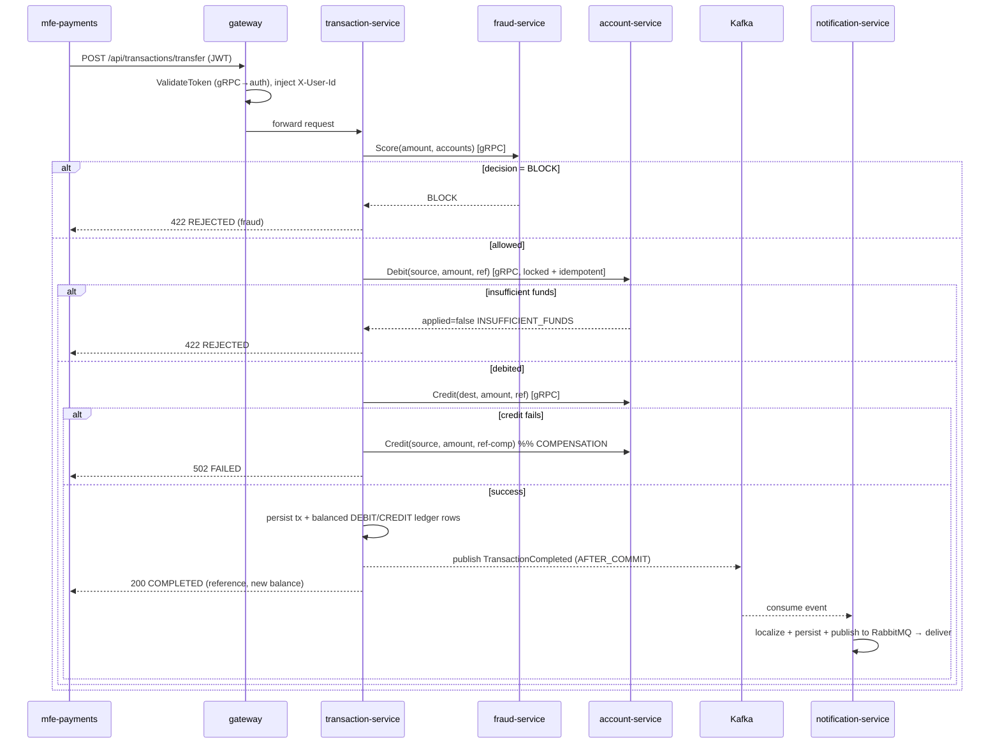
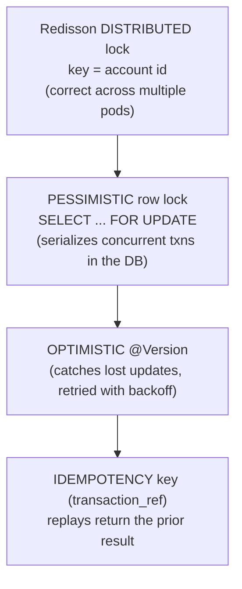
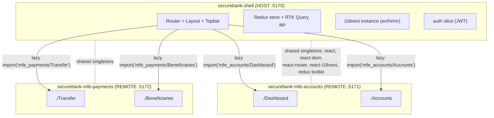
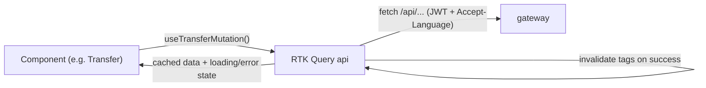

# SecureBank — Frontend & Backend Architecture (Detailed)

This document explains, end to end, how the **backend microservices** and the
**micro-frontends** are built, how they are wired together, and how a request flows
through the whole system. It is written to be read top-to-bottom by an engineer who
has never seen the codebase.

> Companion docs: [`ARCHITECTURE.md`](./ARCHITECTURE.md) (topology), the flagship
> [`money-transfer-flow`](./money-transfer-flow.md) sequence, [`grpc-guide.md`](./grpc-guide.md),
> [`micro-frontends.md`](./micro-frontends.md), and [`running-locally.md`](./running-locally.md).

---

## 1. The system at a glance

```mermaid
flowchart TB
  subgraph Browser
    SH["shell (Module Federation HOST)\nrouting · auth · i18n · layout"]
    A["mfe-accounts (REMOTE)\nDashboard · Accounts"]
    P["mfe-payments (REMOTE)\nTransfer · Beneficiaries"]
    SH -. lazy-loads remoteEntry.js .-> A
    SH -. lazy-loads remoteEntry.js .-> P
  end

  GW["api-gateway\nSpring Cloud Gateway (REST, public)"]
  SH -- "REST /api/* (JWT)" --> GW

  subgraph Services["Backend services (private, gRPC mesh)"]
    AUTH["auth-service\nREST + gRPC"]
    ACC["account-service\ngRPC (balances, locks)"]
    TX["transaction-service\nsaga orchestrator"]
    FR["fraud-service\nAI: scoring/assistant/insights"]
    NO["notification-service\nKafka→RabbitMQ"]
  end

  GW -- "gRPC ValidateToken" --> AUTH
  GW -- REST --> AUTH
  GW -- REST --> ACC
  GW -- REST --> TX
  GW -- REST --> FR
  TX -- "gRPC Score" --> FR
  TX -- "gRPC Debit/Credit" --> ACC
  TX -- "Kafka: TransactionCompleted" --> NO
  NO -- "RabbitMQ: delivery" --> NO

  PG[("PostgreSQL\nDB-per-service")]
  RD[("Redis\ncache + distributed locks")]
  AUTH --- PG
  ACC --- PG
  TX --- PG
  NO --- PG
  ACC --- RD
  FR --- RD
```

Two communication planes:
- **Synchronous** = **gRPC** (Protobuf contracts). Used when a caller needs an answer
  now: gateway→auth (validate token), transaction→fraud (score), transaction→account
  (debit/credit).
- **Asynchronous** = **Kafka** (domain events) + **RabbitMQ** (delivery queue). Used to
  decouple side-effects: a completed transfer emits an event; notification-service reacts
  on its own time.

Why both gRPC *and* Kafka/RabbitMQ? gRPC gives low-latency, strongly-typed request/reply
for the critical money path. Kafka/RabbitMQ give durability and decoupling for fan-out
side-effects (notifications, analytics) without slowing the money path or coupling the
services. This is the standard "command = gRPC, event = broker" split.

---

## 2. Backend architecture

### 2.1 Service catalogue

| Service | Owns | Sync API | Data store | Key patterns |
|---|---|---|---|---|
| **gateway** | edge routing, auth enforcement | REST in, gRPC out | — | API Gateway, Filter chain, Trusted Subsystem |
| **auth-service** | identity, JWT | REST (login/register/refresh) + gRPC server | Postgres `auth` | Token authority, BCrypt, lockout |
| **account-service** | accounts, balances | gRPC server + read REST | Postgres `accounts` + Redis | Factory, Decorator(cache), 3-tier locking, Idempotency |
| **transaction-service** | money movement, ledger | gRPC server + REST + gRPC client | Postgres `ledger` | Saga + compensation, Circuit Breaker, double-entry |
| **fraud-service** | AI scoring/assistant/insights | gRPC server + REST | Redis | Strategy, Adapter, Circuit Breaker |
| **notification-service** | notifications | Kafka consumer / RabbitMQ | Postgres `notifications` | Observer/pub-sub, Strategy(channel) |

Every service is **Java 21 + Spring Boot 3.3** with **virtual threads enabled**
(`spring.threads.virtual.enabled=true`) so blocking JDBC/gRPC calls scale without a
thread-pool bottleneck — each request runs on its own cheap virtual thread.

### 2.2 Internal layering (every service follows this)



- **API layer**: a REST `@RestController` (for browser-facing reads via the gateway) and/or
  a gRPC service implementation (`*Grpc.*ImplBase`) for inter-service calls.
- **Service layer**: business rules, transaction boundaries (`@Transactional`).
  Constructor injection only.
- **Domain**: JPA entities; money is always `BigDecimal` (DB `NUMERIC(19,4)`), never a float.
- **Repository**: Spring Data JPA; pessimistic-lock queries where needed.
- **Mappers**: convert the Protobuf `Money {currency, units, nanos}` wire type to/from
  `BigDecimal`, and entities to/from DTOs (entities are never exposed directly).

### 2.3 The gRPC contracts (`securebank-contracts`)

Protobuf is the single source of truth for inter-service messages. The four service
contracts (`AuthService`, `AccountService`, `TransactionService`, `FraudService`) live in
`securebank-contracts/proto/`. Each service **vendors** the protos it needs into its own
`src/main/proto/` and generates Java stubs at build time (`protobuf-maven-plugin`), so
every repo builds independently. See [`grpc-guide.md`](./grpc-guide.md).

### 2.4 The money path — a Saga with compensation

`transaction-service` is an **orchestration saga**: it owns the workflow but not the data
it touches. A transfer is a sequence of gRPC calls, each individually safe, with a
**compensating action** if a later step fails (there is no distributed transaction across
service databases — that is intentional; we trade 2PC for a saga).



The gRPC calls from the saga are wrapped in **Resilience4j** retry + circuit breaker. The
transfer `reference` is the **idempotency key** passed to account-service so a retried
Debit/Credit never double-applies.

### 2.5 Balance safety — three layers of locking (account-service)

`Debit`/`Credit` mutate money, so they are protected at three levels (defence in depth):



Transfers acquire account locks in **ascending account-id order** to avoid deadlocks.
See [account-service docs](../../securebank-account-service/docs/account-service.md).

### 2.6 AI (fraud-service)

- **Score** — *Strategy* pattern: `RuleBasedFraudStrategy` (thresholds, velocity, new payee)
  + `StatisticalFraudStrategy` (z-score vs baseline), blended into `0..1` →
  `ALLOW/REVIEW/BLOCK`.
- **Ask / Insights** — *Adapter* pattern: `AiProvider` with `LlmAiProvider` (Claude,
  model `claude-opus-4-8`, wrapped in a **circuit breaker**) and `DeterministicAiProvider`.
  With no API key configured (the default) it runs fully offline on the deterministic
  provider — so the platform works out of the box and the LLM is a drop-in upgrade.

### 2.7 Security

JWTs are minted by auth-service (HS256, issuer `securebank`, access + refresh). The
**gateway** is the single enforcement point: it calls `AuthService.ValidateToken` over
gRPC and, on success, injects trusted `X-User-Id` / `X-Roles` / `X-Locale` headers (and
strips any client-supplied copies) before forwarding to the internal network. Downstream
services trust those headers because only the gateway can reach them. See
[`security`](../../securebank-gateway/docs/gateway.md).

---

## 3. Frontend architecture (micro-frontends)

### 3.1 Module Federation: one shell, many remotes

The UI is split into independently-deployable apps composed at **runtime** via
**Module Federation** (`@originjs/vite-plugin-federation`):



- The **shell** owns cross-cutting concerns: routing, layout/top bar, authentication
  (the JWT lives in the shell's store + `localStorage`), the single i18next instance, and
  the design tokens. It lazy-loads remote modules behind `React.Suspense` + an
  `ErrorBoundary` so a remote that fails to load degrades gracefully instead of crashing
  the page.
- **Remotes** expose React components (`exposes: { './Dashboard': ... }`) compiled into a
  `remoteEntry.js` manifest the shell fetches at runtime. Each remote also runs
  **standalone** (its own dev harness on 5171/5172) for isolated development.
- **Shared singletons** ensure there is exactly one copy of React, the router, i18next and
  Redux Toolkit across the federation — so context, hooks and the i18n language are shared,
  not duplicated.

### 3.2 The auth contract between shell and remotes

A remote needs the user's JWT to call the API. The contract: the shell writes the token to
`localStorage["securebank.token"]` (and exposes it on `window.__SECUREBANK__`); each remote
reads it per-request when building its `Authorization` header. So a remote works **embedded**
(reusing the shell's token) and **standalone** (paste-a-token dev harness) with the same code.

### 3.3 Data layer — RTK Query

Each app uses **Redux Toolkit Query** to talk to the gateway:
- `baseQuery` targets `/api` (proxied to the gateway), attaches `Authorization: Bearer <jwt>`
  and `Accept-Language` (from the current i18next language, so the **backend returns
  localized error messages**).
- **Tags + invalidation**: a successful transfer invalidates the `Accounts`/`Transactions`
  tags, so balances and history refetch automatically — no manual refresh.
- A 401 triggers a single silent refresh via the refresh token, then retries.



### 3.4 i18n (en / hi / mr)

react-i18next is initialized **once** in the shell; remotes reuse that instance and merge
their own translation bundles. The same `Accept-Language` header is sent to the backend, so
both UI strings *and* server-side validation/error messages are localized to English, Hindi
(हिन्दी) or Marathi (मराठी). See [`micro-frontends.md`](./micro-frontends.md) and the
shell's `docs/micro-frontend-contract.md`.

### 3.5 UI system

shadcn/ui components on Tailwind CSS with a shared banking palette (light + dark). Money is
formatted with `Intl.NumberFormat` honouring the active locale and the account currency.

---

## 4. End-to-end request lifecycle (putting it together)

1. Browser loads the **shell** (`:5170`). The shell renders the layout and lazy-loads the
   route's remote module (`remoteEntry.js` from `:5171`/`:5172`).
2. The user logs in → `POST /api/auth/login` (through the gateway → auth-service). The JWT is
   stored by the shell.
3. The user opens **Transfer** (mfe-payments). It fetches accounts via RTK Query
   (`GET /api/accounts`) → gateway validates the JWT over gRPC → routes to account-service.
4. The user submits a transfer → `POST /api/transactions/transfer` → gateway → the
   **transaction-service saga** (fraud gRPC → account Debit/Credit gRPC → ledger → Kafka).
5. notification-service consumes the Kafka event, localizes a message, and delivers it via
   RabbitMQ. RTK Query invalidation refreshes the account balances in the UI.

---

## 5. How it is deployed / run

- **Local**: one `docker compose up` from `securebank-platform` brings up every service +
  Postgres/Redis/Kafka/RabbitMQ. See [`running-locally.md`](./running-locally.md) for the
  exact commands, ports, and a full curl walkthrough.
- **Kubernetes**: one Deployment+Service per repo, an Ingress (`/`→shell, `/api`→gateway),
  HPAs on the hot services, kustomize `dev`/`prod` overlays. See
  [`kubernetes-guide.md`](./kubernetes-guide.md).
- **CI/CD**: each repo has its own GitHub Actions workflow and is independently deployable —
  that independence is the whole point of the microservice + micro-frontend split.
