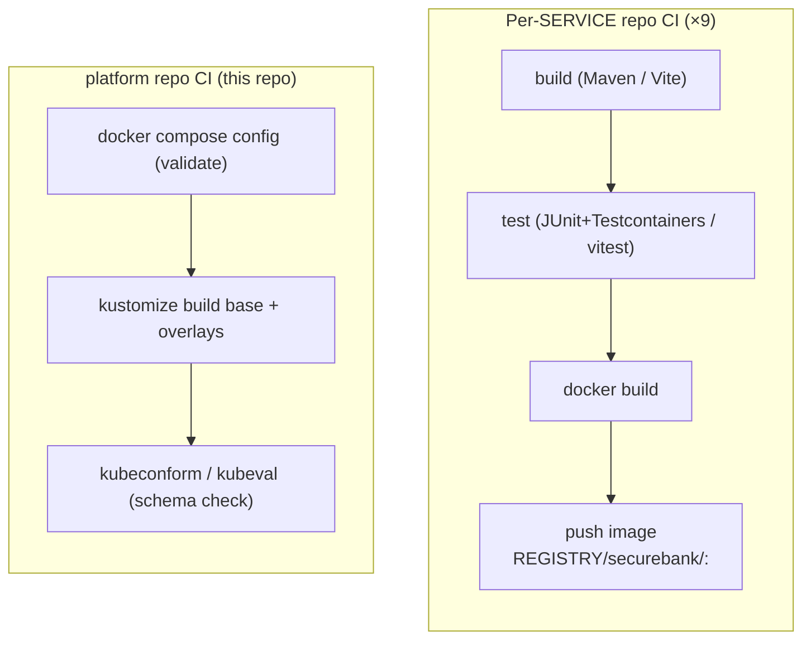

# CI/CD

> Each repo builds and ships **independently** — the whole point of the architecture.
> The platform repo's CI only validates the glue (compose + kustomize). There is no
> monorepo build.

---

## 1. Two kinds of pipeline



| Repo | CI builds | CI publishes |
|---|---|---|
| `securebank-contracts` | proto → stub jar | the `securebank-contracts` jar (consumers depend on it or vendor protos) |
| `securebank-gateway` …​ `-notification-service` | fat jar + image | `REGISTRY/securebank/<svc>:<tag>` |
| `securebank-shell` / `-mfe-*` | static bundle + nginx image | `REGISTRY/securebank/<mfe>:<tag>` |
| `securebank-platform` (here) | **validates** compose + kustomize | nothing (no app artifact) |

---

## 2. Independent deploys

Because every service is its own image and the k8s manifests reference images by
name+tag, a single team can ship without coordinating a platform release:

```mermaid
sequenceDiagram
    participant Dev as account team
    participant CI as account-service CI
    participant Reg as Registry
    participant CD as GitOps / kubectl
    Dev->>CI: merge to main
    CI->>CI: test + build
    CI->>Reg: push securebank/account-service:<sha>
    CD->>CD: bump image tag in prod overlay (Argo CD / kustomize edit)
    CD->>CD: kubectl apply -k overlays/prod
    Note over CD: only account-service Deployment rolls;<br/>others untouched
```

The **one coordination point** is the micro-frontend shared-singleton versions and
the gRPC contract: a breaking `securebank-contracts` change must be rolled out
producer-then-consumer (or use additive, backward-compatible proto changes — new
fields, never renumbered/removed). Everything else deploys on its own cadence.

---

## 3. This repo's CI (`.github/workflows/ci.yml`)

It does **not** build the services (their own repos do). It guards the deployment
glue so a bad compose/kustomize change can't merge:

1. **Validate docker-compose** — `docker compose config -q` parses and resolves the
   file (anchors, env interpolation, profiles).
2. **Build kustomize** — `kustomize build k8s/base`, `.../overlays/dev`,
   `.../overlays/prod` all render without error.
3. **Schema-check the rendered manifests** — `kubeconform` validates them against the
   Kubernetes API schemas.

See [`.github/workflows/ci.yml`](../.github/workflows/ci.yml).

---

## 4. Recommended per-service workflow (reference)

Each service repo already ships its own `.github/workflows/ci.yml` (spec §7). A
typical JVM-service pipeline:

```yaml
# (lives in e.g. securebank-account-service/.github/workflows/ci.yml — reference only)
name: ci
on: { push: { branches: [main] }, pull_request: {} }
jobs:
  build:
    runs-on: ubuntu-latest
    steps:
      - uses: actions/checkout@v4
      - uses: actions/setup-java@v4
        with: { distribution: temurin, java-version: '21', cache: maven }
      - run: mvn -B verify                       # compiles, gen stubs, Testcontainers tests
      - uses: docker/build-push-action@v6        # build + push on main
        with:
          push: ${{ github.ref == 'refs/heads/main' }}
          tags: ${{ vars.REGISTRY }}/securebank/account-service:${{ github.sha }}
```

A frontend pipeline runs `npm ci && npm run build` then builds the nginx image the
same way.

---

## 5. Promotion / GitOps

- Tag images with the **git SHA** (immutable) in CI; tag a release as `1.x.y`.
- Promote by editing the **prod overlay** image tags (`kustomize edit set image ...`)
  and letting **Argo CD / Flux** reconcile, or `kubectl apply -k overlays/prod`.
- Roll back by reverting the overlay commit — the manifests are the source of truth.
