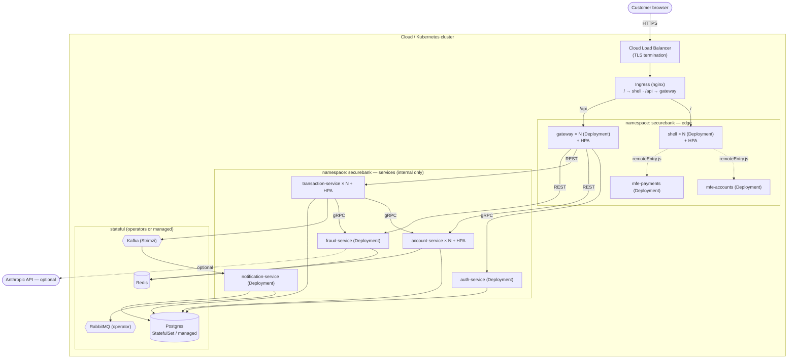
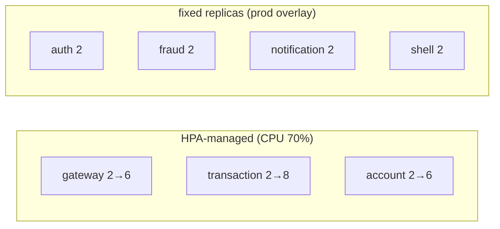

# Deployment Topology

> Where each piece runs in a production-shaped Kubernetes deployment, and how traffic
> enters.

---

## 1. Deployment diagram

---

## 2. What is exposed where

| Tier | Components | Exposure |
|---|---|---|
| Edge | Ingress → shell (`/`), gateway (`/api`) | **Public** (behind LB + TLS) |
| Services | auth, account, transaction, fraud, notification | **Cluster-internal** (ClusterIP only) |
| gRPC | 9091/9092/9093/9094 named ports | **Cluster-internal**, never via Ingress |
| Data | Postgres, Redis, Kafka, RabbitMQ | **Cluster-internal** / managed endpoints |

Only two things ever face the internet: the **shell** (static UI) and the
**gateway** (`/api`). Everything else is reachable only by service name inside the
namespace.

---

## 3. Scaling profile

- The **hot path** (public gateway + the transfer saga's transaction & account
  services) autoscales on CPU.
- **notification-service** scales with Kafka consumer-group parallelism (add replicas
  up to the partition count of `securebank.transactions`).
- **Stateful infra** scales via its operator (Strimzi brokers, Postgres replicas),
  not HPA.

---

## 4. Environments

| Env | Overlay | DB / Kafka | Replicas | Secrets |
|---|---|---|---|---|
| Local docker | `docker-compose.yml` | in-compose containers | 1 each | `.env` |
| Dev cluster | `k8s/overlays/dev` | in-cluster StatefulSets | 1 each, no HPA | template Secret |
| Prod | `k8s/overlays/prod` | managed / operators | floors + HPA | SealedSecret / Vault |

See [`kubernetes-guide.md`](./kubernetes-guide.md) for apply commands and
[`cicd.md`](./cicd.md) for how images get built and promoted.
