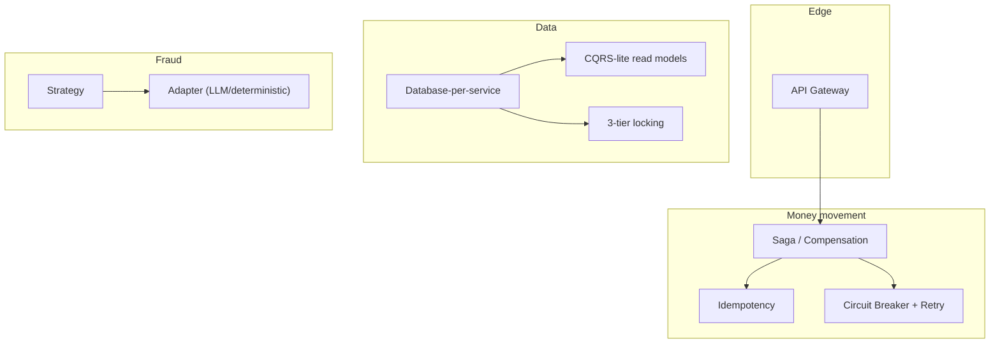
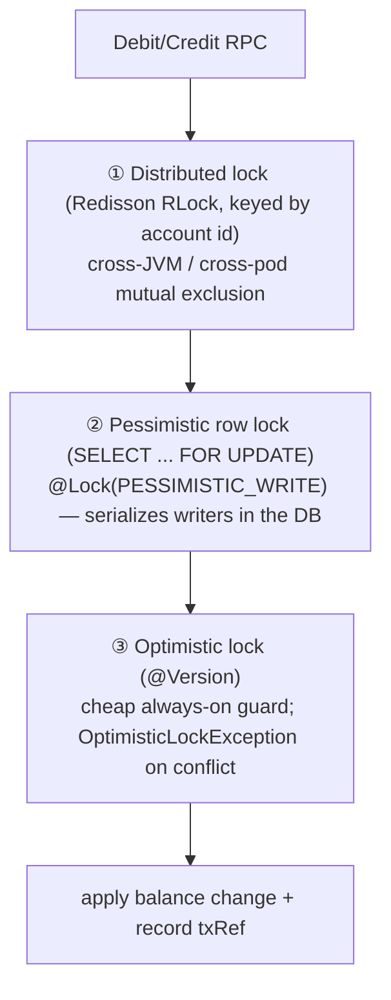

# Design Patterns — system level

> The patterns that hold SecureBank together, where each is applied, and why. This is
> the *system* view; service-internal patterns (e.g. the three locks in
> account-service) are included because they are load-bearing for the platform.

---

## Map

---

## 1. API Gateway

**What:** a single public entrypoint (Spring Cloud Gateway) that routes `/api/*` to
internal services, applies cross-cutting concerns (auth, circuit breaking, timeouts,
CORS dedupe), and is the only thing exposed to the internet.

**Where:** `securebank-gateway`. Routes in `application.yml` /
`application-docker.yml`; it validates every token via gRPC `AuthService.ValidateToken`
and forwards trusted `X-User-Id` / `X-Roles` headers downstream.

**Why:** clients see one stable surface; services stay internal and don't each
re-implement auth/TLS/rate-limiting. Centralizes the security perimeter.

---

## 2. BFF-less gateway (thin gateway, not a Backend-for-Frontend)

**What:** the gateway **routes and authenticates** but does **not** aggregate or
reshape responses per client. There is no per-frontend BFF layer.

**Where:** the gateway forwards to a single downstream per route (no fan-out/compose).
The micro-frontends call the same `/api` surface and shape data client-side (RTK
Query).

**Why:** keeps the gateway simple, stateless and horizontally scalable; avoids a
chatty aggregation tier. The UIs (shell + remotes) are already componentized, so a BFF
would add coupling for little gain. When a true aggregation need appears, it belongs in
a dedicated service, not smeared into the gateway.

---

## 3. Saga / Compensation (orchestration)

**What:** a multi-service business transaction (the money transfer) implemented as a
sequence of **local** transactions coordinated by an **orchestrator**, with
**compensating actions** to undo committed steps on failure. No 2PC.

**Where:** `securebank-transaction-service` orchestrates
`fraud.Score → account.Debit → account.Credit`, writes its ledger, publishes to Kafka;
on a failed credit it compensates by crediting the source back. Full diagrams in
[`money-transfer-flow.md`](./money-transfer-flow.md).

**Why:** there is no shared transaction manager across services (database-per-service).
The saga trades strict atomicity for availability + loose coupling, and recovers
consistency via compensation.

---

## 4. Database-per-service

**What:** each service owns its own schema/database; no service reads another's tables.

**Where:** `auth` (own DB), `accounts` / `ledger` / `notifications` (own schemas in the
shared `securebank` DB), each with its own Flyway. fraud-service has no RDBMS (Redis
only). Details in [`ARCHITECTURE.md`](./ARCHITECTURE.md#4-database-per-service).

**Why:** independent schema evolution, independent scaling, and a hard data boundary —
the precondition that *forces* the saga + gRPC patterns above. Cross-service data is
obtained by **calling the owner**, never by reaching into its tables.

---

## 5. CQRS-lite read models

**What:** separate the **write** path from optimized **read** views. "Lite" = same
service, no separate event-sourced store — just a denormalized read model kept current
from the write side.

**Where:**
- transaction-service writes a **double-entry ledger** (the write model) and serves
  transaction history/statement reads from a query-shaped projection.
- notification-service builds a **read model of rendered, localized messages** from the
  inbound `TransactionCompleted` events — the Kafka event stream is the write side, the
  `notifications` schema is the queryable read side.

**Why:** balance-mutating writes and history queries have very different shapes and
load; separating them lets each be tuned without one distorting the other. Going
"lite" avoids the operational weight of full CQRS/event-sourcing until it's warranted.

---

## 6. Circuit Breaker (+ Retry, + Timeout)

**What:** wrap remote calls so a failing/slow dependency trips a breaker and
short-circuits to a fallback instead of cascading failures; retry transient errors;
cap latency with timeouts.

**Where (Resilience4j):**
- gateway — per-route breakers (`authCircuit`, `accountCircuit`, …) with TimeLimiters
  and a `/__fallback` route.
- transaction-service — breaker + retry on the gRPC `account` and `fraud` calls.
- fraud-service — breaker + retry around the LLM provider (`llmProvider`), degrading
  to the deterministic provider when it opens.

**Why:** in a mesh, one slow service must not exhaust callers' threads and take down
the system. The breaker contains the blast radius; retry handles blips (safe because
the mutating RPCs are idempotent — see below).

---

## 7. Strategy (fraud scoring)

**What:** interchangeable algorithms behind one interface, chosen at runtime.

**Where:** fraud-service scores a transfer using pluggable strategies — **rule-based**
and **statistical** scorers combined into a decision (`ALLOW | REVIEW | BLOCK`). The
`Score` RPC's behaviour is the composition of these strategies.

**Why:** fraud logic changes often; new scorers can be added/weighted without touching
callers. The contract (`ScoreRequest → ScoreResult`) stays fixed.

---

## 8. Adapter (LLM vs deterministic provider in fraud)

**What:** present a uniform interface to two very different implementations — a live
LLM (Claude) and a deterministic local provider — and swap them transparently.

**Where:** fraud-service's assistant (`Ask`) and insights (`Insights`). With an API key
+ healthy breaker it adapts the Anthropic API to the internal provider interface; with
no key or an open breaker it falls back to the deterministic adapter. Same RPC, same
response shape (`AskReply.from_llm` just flips).

**Why:** the service runs fully offline in dev/CI and degrades gracefully in prod; the
rest of the system never knows or cares which provider answered.

---

## 9. Idempotency (idempotency key)

**What:** make an operation safe to apply more than once by keying it; a repeat with
the same key returns the original result instead of re-applying.

**Where:** account-service `Debit` / `Credit` are idempotent on `transaction_ref`
(account.proto). transaction-service's Resilience4j retries reuse the same ref, so a
retried debit moves money **at most once**. The compensating credit uses a *distinct*
ref.

**Why:** at-least-once retries (and Kafka at-least-once delivery on the consumer side)
are only safe if the effecting operation is idempotent. This is what makes the saga's
retries correct rather than dangerous.

---

## 10. The three locking patterns in account-service

account-service is the **only** writer of balances, and it defends every mutation with
three cooperating layers (see `Account.java`, `AccountRepository.findByIdForUpdate`,
`DistributedLockExecutor`):

| Layer | Mechanism | Scope it protects against | Why it's needed |
|---|---|---|---|
| ① Distributed lock | Redisson `RLock` keyed by account id | Two **different processes/pods** racing the same account | DB row locks don't help if the contention is "who gets to start the transaction"; the distributed lock serializes mutators across the whole fleet before they hit the DB. |
| ② Pessimistic lock | `SELECT ... FOR UPDATE` via `@Lock(PESSIMISTIC_WRITE)` | Concurrent transactions in the **same DB** | Blocks any other writer of that row until commit — the authoritative serialization point for the balance. |
| ③ Optimistic lock | JPA `@Version` | A stale write slipping through (defense in depth) | Cheap, always-on; if anything bypassed ①/② the version check raises `OptimisticLockException` rather than silently corrupting the balance. |

**Why all three:** ① and ② are belt-and-suspenders across the *distributed* and
*database* boundaries respectively; ③ is the last-line correctness guarantee. Money
correctness justifies the redundancy. Idempotency (#9) sits alongside so a retry inside
the lock still applies once.

---

## 11. Trusted-subsystem / claims propagation (honorable mention)

**What:** authenticate once at the edge, then pass a small **trusted claims** object
inward instead of re-validating credentials at every hop.

**Where:** gateway validates the JWT (gRPC `ValidateToken`) and forwards `X-User-Id` /
`X-Roles` on the internal network; services trust those headers because the network is
internal and the gateway is the only ingress.

**Why:** avoids every service re-parsing JWTs and sharing the signing key; centralizes
the auth decision. (In a zero-trust setup, pair this with mTLS so only the gateway can
set those headers — see [`grpc-guide.md`](./grpc-guide.md#5-tls--mtls-note).)
