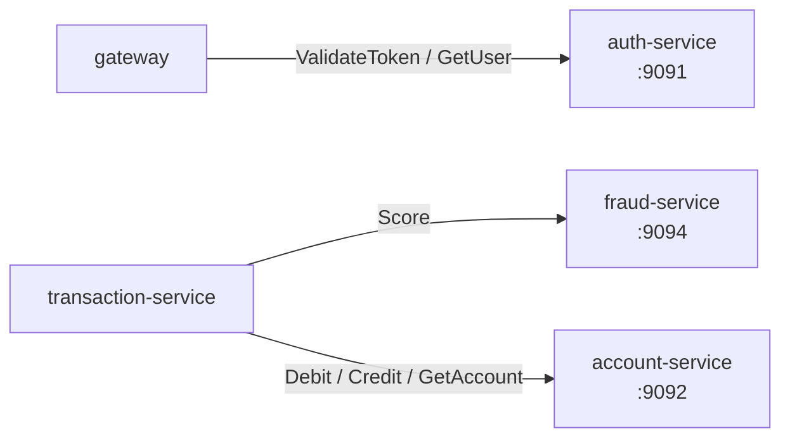

# gRPC Guide

> How SecureBank services talk to each other synchronously. All inter-service
> request/response calls go over **gRPC** (Protobuf contracts), never REST. REST is
> reserved for the public surface served by the gateway.

---

## 1. The contracts

Canonical `.proto` files live in **`securebank-contracts/proto/`**. Each service either
depends on the published `securebank-contracts` stub jar **or** vendors a copy of the
protos it needs under its own `src/main/proto/` and generates stubs with
`org.xolstice.maven.plugins:protobuf-maven-plugin`. (This platform's services vendor
the protos so each repo builds independently.)

| Proto package | Service | RPCs |
|---|---|---|
| `securebank.auth.v1` | AuthService | `ValidateToken`, `GetUser` |
| `securebank.account.v1` | AccountService | `GetAccount`, `ListAccounts`, `OpenAccount`, `Debit`, `Credit` |
| `securebank.transaction.v1` | TransactionService | `Transfer`, `GetTransaction` |
| `securebank.fraud.v1` | FraudService | `Score`, `Ask`, `Insights` |
| `securebank.common.v1` | (shared) | `Money`, `PageRequest` |

**Money on the wire** is never a float:

```protobuf
message Money { string currency = 1; int64 units = 2; int32 nanos = 3; }
// 1.25 INR -> { currency:"INR", units:1, nanos:250000000 }; mapped to BigDecimal(scale 4).
```

---

## 2. Who calls whom (and on which port)



| Caller | Callee | Address (docker/k8s) | Port |
|---|---|---|---|
| gateway | auth-service | `static://auth-service:9091` | 9091 |
| transaction-service | account-service | `static://account-service:9092` | 9092 |
| transaction-service | fraud-service | `static://fraud-service:9094` | 9094 |

> gRPC ports are **internal only** — they are not published to the host in
> docker-compose and are separate named ports on the k8s Services. The Kafka broker
> uses 29092 specifically to stay clear of the 909x gRPC range (spec §8).

---

## 3. How it's wired in Spring (net.devh)

**Server side** (`grpc-spring-boot-starter`) — a service exposes an RPC by annotating
its implementation:

```java
@GrpcService                              // registers the service on grpc.server.port
public class AccountGrpcService extends AccountServiceGrpc.AccountServiceImplBase {
    @Override
    public void debit(BalanceChangeRequest req, StreamObserver<BalanceChangeResult> obs) { ... }
}
```

```yaml
# application.yml
grpc:
  server:
    port: 9092          # bound to 0.0.0.0 in the docker profile
```

**Client side** (`grpc-client-spring-boot-starter`) — a caller injects a stub by the
named channel:

```java
@GrpcClient("account-service")            // matches grpc.client.account-service.*
private AccountServiceGrpc.AccountServiceBlockingStub accountStub;
```

```yaml
# application-docker.yml
grpc:
  client:
    account-service:
      address: static://account-service:9092
      negotiation-type: plaintext
```

In compose/k8s the named-channel address is supplied by each service's **docker
profile** (`application-docker.yml`, baked into the image) rather than by an env var —
net.devh's property key contains a hyphen (`grpc.client.auth-service.address`) which
doesn't round-trip cleanly through an `UPPER_SNAKE` env name. Because the in-network
hostnames are the Service names (`auth-service`, `account-service`, `fraud-service`),
the profile values work unchanged in both docker and Kubernetes.

---

## 4. Testing an RPC with `grpcurl`

The services run **gRPC reflection** in dev, so you don't need the `.proto` on hand.

```bash
# Install grpcurl (one of):
#   brew install grpcurl   |   go install github.com/fullstorydev/grpcurl/cmd/grpcurl@latest
#   or download a release binary.

# --- Reach a gRPC port. It's internal-only, so exec into the network. ---
# Option A: run grpcurl INSIDE the docker network (recommended):
docker run --rm --network securebank_default fullstorydev/grpcurl:latest \
  -plaintext auth-service:9091 list

# Option B: temporarily publish a gRPC port for local poking, e.g. add
#   ports: ["9092:9092"] to account-service in a compose override, then:
grpcurl -plaintext localhost:9092 list
```

```bash
# List services and methods exposed by auth-service:
grpcurl -plaintext auth-service:9091 list
# -> securebank.auth.v1.AuthService
grpcurl -plaintext auth-service:9091 list securebank.auth.v1.AuthService

# Call ValidateToken with a JWT (get one from the login curl in running-locally.md):
grpcurl -plaintext -d '{"access_token":"<JWT>"}' \
  auth-service:9091 securebank.auth.v1.AuthService/ValidateToken

# Call account Debit (note Money as units/nanos), idempotent on transaction_ref:
grpcurl -plaintext -d '{
  "account_id":"<ACCT>",
  "amount":{"currency":"INR","units":100,"nanos":0},
  "transaction_ref":"demo-ref-1",
  "description":"grpcurl test"
}' account-service:9092 securebank.account.v1.AccountService/Debit
```

On Kubernetes, port-forward the gRPC port first:

```bash
kubectl -n securebank port-forward svc/account-service 9092:9092
grpcurl -plaintext localhost:9092 list
```

---

## 5. TLS / mTLS note

All gRPC here uses `negotiation-type: plaintext` because traffic stays on the trusted
internal network (docker bridge / cluster network). For production:

- **Service mesh (recommended):** run Istio/Linkerd and let the mesh provide
  **mTLS transparently** — no app code changes; `plaintext` stays in the app and the
  sidecar encrypts in transit.
- **App-level TLS:** switch `negotiation-type: tls`, mount server certs on each gRPC
  server, and distribute the CA to clients (`grpc.client.*.trust-cert-collection`).
  Heavier to operate; prefer the mesh.

Either way, the gateway terminates *public* TLS at the edge; the 909x ports are never
exposed outside the cluster.
