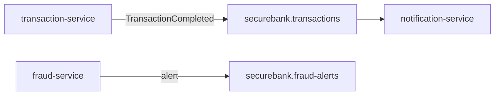

# Kafka Guide

> Kafka is SecureBank's **async domain-event backbone**: durable, replayable,
> multi-consumer. transaction-service publishes facts; notification-service (and any
> future consumer) reacts.

---

## 1. Topics

| Topic | Producer | Consumer(s) | Payload |
|---|---|---|---|
| `securebank.transactions` | transaction-service | notification-service | `TransactionCompleted` (a transfer happened) |
| `securebank.fraud-alerts` | fraud-service | (future: ops/SIEM) | high-risk score alerts |
| `securebank.notifications` | (reserved) | (reserved) | future fan-out of notifications |

Created by the `kafka-init` one-shot (compose) / the `kafka-topics-init` Job (k8s):
3 partitions, replication-factor 1 for local; bump RF in prod (Strimzi).



---

## 2. The listener addressing rule (important)

The broker advertises **`kafka:29092`** on its internal listener. Every in-network
service sets `spring.kafka.bootstrap-servers: kafka:29092`. The host also gets 29092
published (a second EXTERNAL listener advertised as `localhost:9092`) for local
tooling. The `29092` choice keeps Kafka clear of the gRPC `909x` range (spec §8).

```yaml
# docker-compose (kafka service)
KAFKA_LISTENERS: INTERNAL://0.0.0.0:29092,EXTERNAL://0.0.0.0:9092
KAFKA_ADVERTISED_LISTENERS: INTERNAL://kafka:29092,EXTERNAL://localhost:9092
KAFKA_INTER_BROKER_LISTENER_NAME: INTERNAL
```

---

## 3. The Zookeeper `ruok` whitelist (the bug worth remembering)

The Confluent Zookeeper image **locks down** the 4-letter-word admin commands by
default. A healthcheck using `ruok` then receives an empty reply forever, the
healthcheck never goes green, Kafka's `depends_on: zookeeper: condition: healthy`
never fires, and the whole stack hangs. Fix (already applied):

```yaml
zookeeper:
  environment:
    ZOOKEEPER_4LW_COMMANDS_WHITELIST: "ruok,srvr,conf"
  healthcheck:
    test: ["CMD-SHELL", "echo ruok | (exec 3<>/dev/tcp/localhost/2181; cat >&3; cat <&3) | grep -q imok"]
```

---

## 4. Copy-pasteable operations

```bash
# List topics
docker compose exec kafka kafka-topics --bootstrap-server kafka:29092 --list

# Describe a topic (partitions, ISR)
docker compose exec kafka kafka-topics --bootstrap-server kafka:29092 \
  --describe --topic securebank.transactions

# Consume the latest transfer event
docker compose exec kafka kafka-console-consumer --bootstrap-server kafka:29092 \
  --topic securebank.transactions --from-beginning --max-messages 1

# Produce a test message (type JSON, Ctrl-D to end)
docker compose exec -it kafka kafka-console-producer --bootstrap-server kafka:29092 \
  --topic securebank.transactions

# Consumer-group lag (notification-service group)
docker compose exec kafka kafka-consumer-groups --bootstrap-server kafka:29092 \
  --describe --group securebank-notification-service
```

On Kubernetes, exec into the broker pod:

```bash
kubectl -n securebank exec -it kafka-0 -- \
  kafka-topics --bootstrap-server kafka:29092 --list
```

Or use **Kafka UI** (observability profile) at http://localhost:8090.

---

## 5. Production path: Strimzi

For prod, replace the manual broker with the **Strimzi operator** (`Kafka` CR + 3
brokers, persistent storage, optional KRaft/no-Zookeeper) and declare topics as
`KafkaTopic` CRs. A commented example is at the bottom of
[`k8s/base/kafka.yaml`](../k8s/base/kafka.yaml). Benefits: rolling upgrades, rack
awareness, TLS/SCRAM auth, and topic management as Kubernetes resources.

---

## 6. Delivery semantics & ordering

- transaction-service keys events by account/reference so a given account's events
  land on the **same partition** (per-key ordering).
- notification-service is an **idempotent consumer**: re-processing the same
  `TransactionCompleted` (after a redelivery) must not double-notify — it dedupes on
  the transaction reference. This pairs with at-least-once Kafka delivery.
- The transfer's correctness does **not** depend on the event being consumed — it's a
  downstream reaction (see [`money-transfer-flow.md`](./money-transfer-flow.md)).
