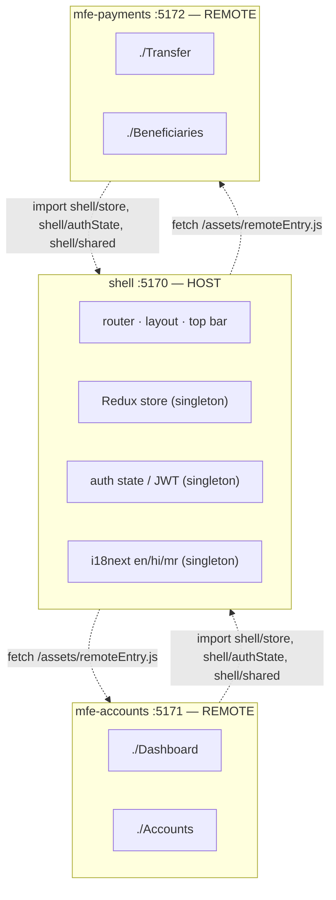
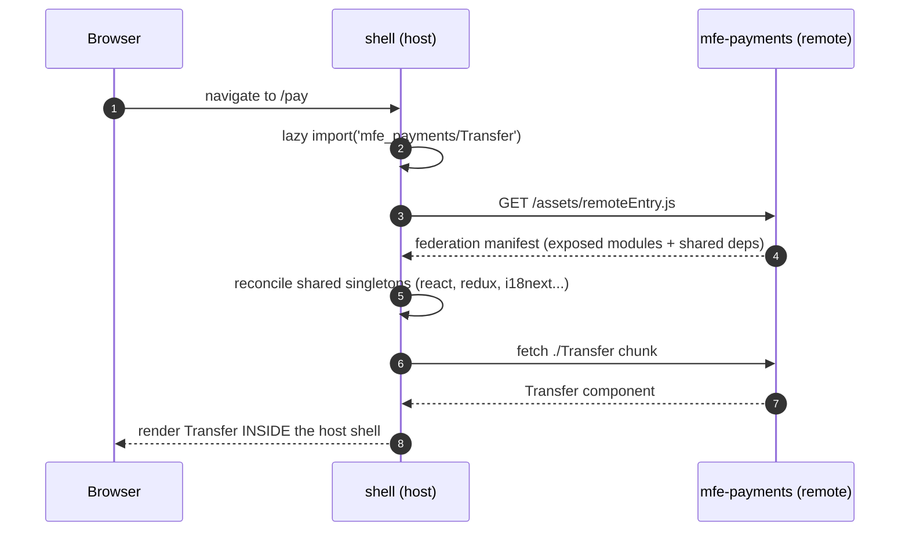
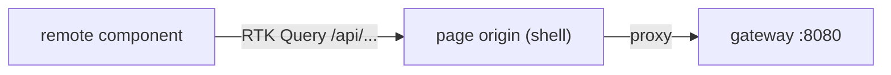
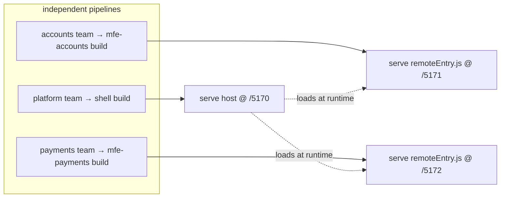

# Micro-Frontends — Module Federation

> SecureBank's UI is split into independently-built, independently-deployed React
> apps stitched together at **runtime** with Module Federation
> (`@originjs/vite-plugin-federation`). One **host** (shell) loads two **remotes**
> (mfe-accounts, mfe-payments).

---

## 1. Topology



- **shell = host.** Owns routing, layout, the top bar, auth (JWT in the store), i18n
  init (en/hi/mr), theme and the shared design tokens. It **also exposes** modules so
  the remotes reuse its singletons.
- **mfe-accounts** exposes `./Dashboard` and `./Accounts`.
- **mfe-payments** exposes `./Transfer` and `./Beneficiaries`.

---

## 2. How the shell loads a remote at runtime



From the shell's `vite.config.ts`:

```ts
federation({
  name: 'securebank_shell',
  remotes: {
    mfe_accounts: 'http://localhost:5171/assets/remoteEntry.js',
    mfe_payments: 'http://localhost:5172/assets/remoteEntry.js',
  },
  exposes: {
    './store':     './src/store/exposed-store.ts',   // the configured Redux store
    './authState': './src/store/exposed-auth.ts',    // current JWT + user selectors
    './shared':    './src/shared/exposed-shared.ts',  // RTK Query baseQuery + i18next
  },
  shared: {
    react:               { singleton: true, requiredVersion: '^18.3.1' },
    'react-dom':         { singleton: true, requiredVersion: '^18.3.1' },
    'react-router-dom':  { singleton: true, requiredVersion: '^6.26.1' },
    'react-i18next':     { singleton: true, requiredVersion: '^15.0.1' },
    i18next:             { singleton: true, requiredVersion: '^23.14.0' },
    '@reduxjs/toolkit':  { singleton: true, requiredVersion: '^2.2.7' },
    'react-redux':       { singleton: true, requiredVersion: '^9.1.2' },
  },
})
```

> Build target must be **`esnext`** — the federation plugin emits top-level-await +
> dynamic-import output that lower targets cannot represent.

---

## 3. Shared singletons (why `singleton: true` matters)

| Library | Why exactly one copy |
|---|---|
| `react` / `react-dom` | Two Reacts ⇒ "invalid hook call" — hooks break across the boundary. |
| `react-router-dom` | One history/router context, so the remote's links drive the host's URL. |
| `@reduxjs/toolkit` + `react-redux` | One store context: a remote dispatches into the **host's** store. |
| `i18next` + `react-i18next` | One translation registry so language switches apply everywhere at once. |

The remotes do **not** create their own store/auth/i18n — they import the shell's via
the exposed `./store`, `./authState`, `./shared`. That is how the customer's JWT and
chosen locale (en/hi/mr) flow into a remote without prop-drilling. The token is also
mirrored on `window.__SECUREBANK__` as a fallback handshake (spec §5).

---

## 4. API access from a remote

Remotes call the gateway via **`/api`** using RTK Query, reusing the shell's
auth token (the `baseQuery` injects `Authorization: Bearer <jwt>` from the shared
store). In dev each app's Vite server proxies `/api` to `http://localhost:8080`; in
the container build nginx proxies `/api` to `http://gateway:8080`. Either way the
browser stays same-origin, so no CORS dance.



---

## 5. Independent dev & deploy

- **Standalone dev:** each MFE runs its own Vite dev server
  (`npm run dev` → 5170/5171/5172) and renders on its own — handy for working on one
  slice without the whole platform.
- **Federated:** start the shell + remotes and the shell stitches them together.
- **Independent deploy:** because remotes are fetched at runtime by URL, the accounts
  team can ship a new `mfe-accounts` build (new `remoteEntry.js` at the same URL)
  without rebuilding or redeploying the shell or the payments MFE. This is the core
  payoff of Module Federation.



**Versioning caveat:** the host and remotes must agree on the **shared singleton
versions** (the `requiredVersion` ranges). Bumping React major in one app without the
others is a breaking change for the federation — coordinate those, but everything
else deploys independently.
