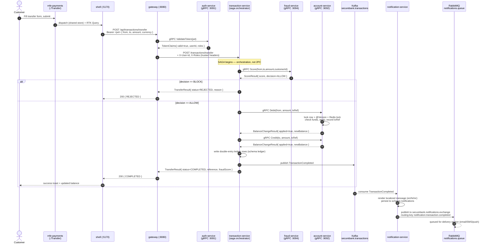
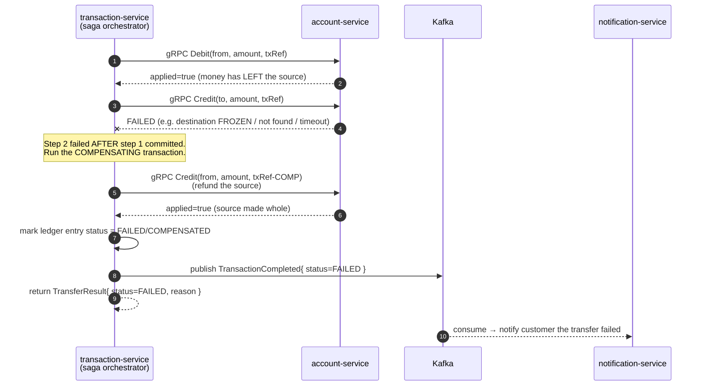
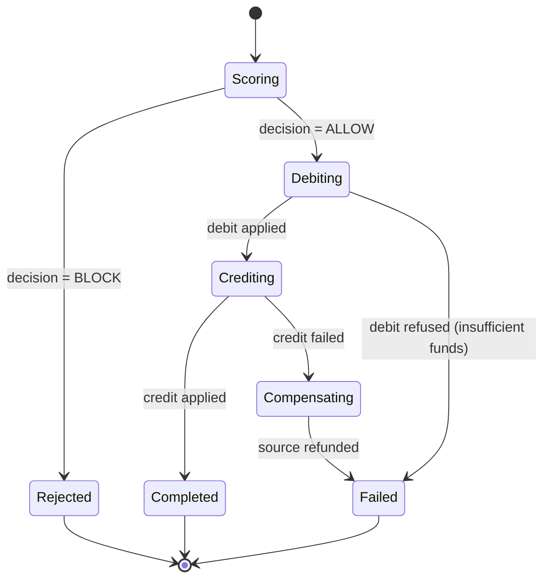

# The Money-Transfer Saga — flagship flow

> This is the single most important flow in SecureBank. A customer initiates a
> transfer in the payments micro-frontend; it crosses the gateway, the
> transaction-service saga orchestrator, the fraud + account services over **gRPC**,
> emits a **Kafka** event, which the notification-service turns into a **RabbitMQ**
> delivery. It includes the **saga compensation path** for a failed credit.

---

## 1. Happy path (end to end)

### Why it is a **saga**, not a distributed transaction

There is no two-phase commit across services. transaction-service **orchestrates** a
sequence of local transactions (Debit on source, Credit on destination), each
committed independently in account-service. If a later step fails, the orchestrator
runs a **compensating action** to undo the earlier committed step. This trades strict
atomicity for availability and loose coupling — the standard microservices answer to
"there is no shared transaction manager".

---

## 2. Compensation path (credit fails after a successful debit)

### Idempotency makes the saga safe to retry

Both `Debit` and `Credit` are **idempotent on `transaction_ref`** (account.proto):
account-service records the ref and, on a repeat with the same ref, returns the
*original* result instead of applying the change again. So when
transaction-service's Resilience4j retry re-sends a `Debit` after a network blip, the
money is **not** moved twice. The compensating credit uses a *distinct* ref so it is
itself idempotent and never confused with the original.

---

## 3. Failure-mode summary

| Step fails | What transaction-service does | Customer sees | Money state |
|---|---|---|---|
| Fraud `Score` unavailable | Circuit breaker → fail closed (REVIEW/REJECT) or retry | REJECTED / pending review | unchanged |
| `Debit` refused (no funds) | Stop the saga, no compensation needed | REJECTED reason=INSUFFICIENT_FUNDS | unchanged |
| `Debit` times out | Retry (idempotent on txRef) | COMPLETED or FAILED | applied at most once |
| `Credit` fails | **Compensate**: refund source via Credit | FAILED | source made whole |
| Kafka publish fails | Transfer already COMPLETED; event retried / outbox | COMPLETED | unchanged (notification delayed) |
| Notification path down | No effect on the transfer | COMPLETED | unchanged |

The boundary is deliberate: **the transfer's correctness depends only on the
synchronous gRPC saga**; the Kafka→Rabbit notification is best-effort and
eventually-consistent.
