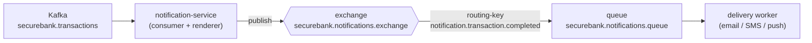

# RabbitMQ Guide

> RabbitMQ is the **outbound delivery work queue** for notification-service. Kafka
> carries the domain event; Rabbit carries the "deliver this one notification" job.

---

## 1. Topology



| Object | Name |
|---|---|
| Exchange | `securebank.notifications.exchange` |
| Queue | `securebank.notifications.queue` |
| Routing key | `notification.transaction.completed` |
| Default vhost / creds (dev) | `/` · `guest` / `guest` |

notification-service declares the exchange/queue/binding on startup (Spring AMQP
`@Bean Declarables`), so they exist before the first publish.

---

## 2. Why Rabbit here and Kafka there?

| | Kafka (`securebank.transactions`) | RabbitMQ (`notifications.queue`) |
|---|---|---|
| Shape | Append-only **event log** | Classic **work queue** |
| Consumers | Many, each at its own offset, replayable | Competing workers, message removed on ack |
| Fit | "This fact happened" — broadcast | "Do this one delivery" — job with ack/retry/DLQ |
| Retry | Re-read by offset | Per-message redelivery + dead-letter |

Using both keeps domain events (replayable, multi-subscriber) cleanly separated from
delivery jobs (ack-per-message, DLQ-able). See
[`ARCHITECTURE.md`](./ARCHITECTURE.md#3-the-three-communication-boundaries).

---

## 3. Copy-pasteable operations

Management UI: **http://localhost:15672** (guest / guest) — Exchanges, Queues,
"Get messages", rates.

```bash
# List queues with depth
docker compose exec rabbitmq rabbitmqctl list_queues name messages messages_ready messages_unacknowledged

# List exchanges and bindings
docker compose exec rabbitmq rabbitmqctl list_exchanges name type
docker compose exec rabbitmq rabbitmqctl list_bindings

# Health
docker compose exec rabbitmq rabbitmq-diagnostics -q ping
docker compose exec rabbitmq rabbitmq-diagnostics status

# Publish a test message via the HTTP API (then watch the queue in the UI)
curl -u guest:guest -H 'content-type: application/json' \
  -X POST http://localhost:15672/api/exchanges/%2f/securebank.notifications.exchange/publish \
  -d '{"properties":{},"routing_key":"notification.transaction.completed","payload":"{\"test\":true}","payload_encoding":"string"}'
```

On Kubernetes:

```bash
kubectl -n securebank exec -it deploy/rabbitmq -- rabbitmqctl list_queues name messages
kubectl -n securebank port-forward svc/rabbitmq 15672:15672   # then open the UI
```

---

## 4. End-to-end check (after a transfer)

1. Do a transfer (running-locally.md §5.3).
2. notification-service logs: `consumed TransactionCompleted ... published to securebank.notifications.queue`.
3. `rabbitmqctl list_queues` shows the queue depth tick up (or the worker drained it).
4. In the UI, open `securebank.notifications.queue` → **Get messages** to inspect the
   rendered, localized body.

---

## 5. Configuration

```yaml
spring:
  rabbitmq:
    host: ${SPRING_RABBITMQ_HOST:rabbitmq}
    port: ${SPRING_RABBITMQ_PORT:5672}
    username: ${SPRING_RABBITMQ_USERNAME:guest}
    password: ${SPRING_RABBITMQ_PASSWORD:guest}
securebank:
  rabbit:
    exchange: securebank.notifications.exchange
    queue: securebank.notifications.queue
    routing-key: notification.transaction.completed
```

Compose injects `SPRING_RABBITMQ_*`; k8s injects host/port from the ConfigMap and
credentials from the Secret.

---

## 6. Production notes

- Replace `guest/guest` (guest cannot log in remotely anyway) with real users and a
  dedicated vhost; rotate via the Secret/Vault.
- Add a **dead-letter exchange** + queue and a delivery-retry policy for failed
  notifications (`x-dead-letter-exchange`, TTL-based retry).
- Run the **RabbitMQ Cluster Operator** for HA (quorum queues) instead of the single
  node used in dev.
