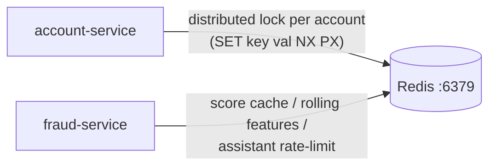
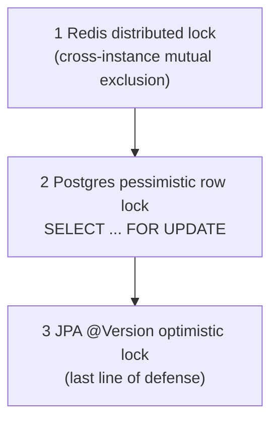

# Redis Guide

> Redis is SecureBank's in-memory store for **distributed locks** (account-service)
> and **caching / scratch state** (fraud-service). No service uses it as a system of
> record.

---

## 1. Who uses Redis, for what



| Service | Use | Pattern |
|---|---|---|
| account-service | A **distributed lock** (Redisson `RLock`, keyed by account id) taken around a balance mutation, on top of the DB row lock + `@Version`. Prevents two transaction-service/account-service replicas from racing the same account across instances. | Redisson `RLock.tryLock(...)` with a lease TTL; auto-released in a `finally`. |
| fraud-service | Cache of recent scores, rolling per-customer features, and assistant throttling. It has **no relational DB**, so Redis is its only store. | `SETEX` with TTL; hashes for feature counters. |

---

## 2. The three layers of locking in account-service

Redis is only the **outermost** of three cooperating mechanisms (full write-up in
[`design-patterns.md`](./design-patterns.md)):



---

## 3. Copy-pasteable operations

```bash
# Open a redis-cli inside the container
docker compose exec redis redis-cli

# Liveness
docker compose exec redis redis-cli ping            # -> PONG

# Watch live commands (handy to SEE locks being taken during a transfer)
docker compose exec redis redis-cli monitor

# Inspect keys
docker compose exec redis redis-cli keys '*lock*'
docker compose exec redis redis-cli keys 'fraud:*'
docker compose exec redis redis-cli ttl  '<account-lock-key>'
docker compose exec redis redis-cli get  'fraud:score:<id>'

# Memory / stats
docker compose exec redis redis-cli info memory
docker compose exec redis redis-cli dbsize
```

On Kubernetes:

```bash
kubectl -n securebank exec -it deploy/redis -- redis-cli ping
kubectl -n securebank exec -it deploy/redis -- redis-cli keys 'lock:*'
```

---

## 4. Observing a lock during a transfer

```bash
# Terminal 1: watch Redis
docker compose exec redis redis-cli monitor

# Terminal 2: fire the transfer from running-locally.md §5.3
# You'll see Redisson SET the account lock key (PX with a lease), then release it
# (DEL via a Lua script) after Debit completes.
```

---

## 5. Configuration

Services read host/port from env (docker profile):

```yaml
spring:
  data:
    redis:
      host: ${REDIS_HOST:redis}     # service name on the network
      port: ${REDIS_PORT:6379}
```

`REDIS_HOST`/`REDIS_PORT` come from the compose env and the k8s ConfigMap
(`securebank-config`).

---

## 6. Production notes

- Use a **managed cache** (ElastiCache / MemoryStore / Azure Cache) or the Redis
  operator; enable persistence (AOF is on in dev) and an eviction policy
  (`allkeys-lru` for cache keys).
- For the distributed lock, the single-node lock here is fine for one Redis; if you
  run Redis HA with failover, use **Redlock** across independent masters to avoid the
  split-brain lock-loss problem. The DB row lock + `@Version` remain the safety net
  regardless.
