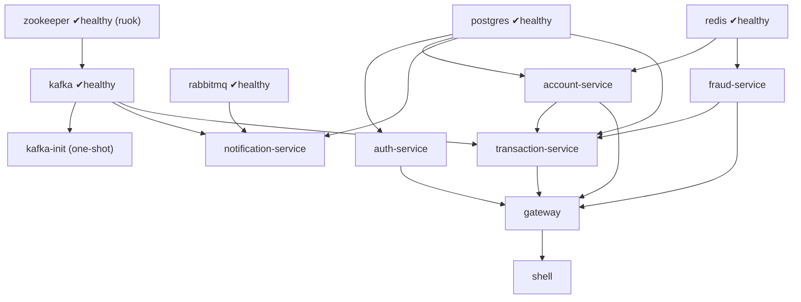

# Running SecureBank locally — THE runbook

> Bring up the entire platform with docker-compose, then walk a real money transfer
> from login → accounts → transfer → Kafka event → RabbitMQ delivery.

---

## 0. Prerequisites

- Docker Engine + the Compose v2 plugin (`docker compose version`).
- ~6 GB free RAM (nine JVM/JS containers + Postgres/Kafka/Rabbit).
- The sibling repos present next to this one (they are the build contexts):
  `../securebank-{gateway,auth-service,account-service,transaction-service,fraud-service,notification-service,shell,mfe-accounts,mfe-payments}`.
- `curl` and `jq` for the walkthrough (optional but assumed below).

---

## 1. Start it

```bash
cd securebank-platform
cp .env.example .env
# Edit .env: set SECUREBANK_JWT_SECRET to a long random value (>=32 bytes):
#   openssl rand -base64 48
docker compose up -d --build          # build + start the full mesh
```

Optional observability stack (Kafka UI, Prometheus, Grafana):

```bash
docker compose --profile observability up -d
```

Watch it come up:

```bash
docker compose ps
docker compose logs -f gateway        # follow one service
```

---

## 2. Startup order (who waits for whom)

`depends_on` + healthchecks enforce this DAG, so a single `up` is enough:



> **The Zookeeper healthcheck gotcha:** the Confluent image disables the `ruok`
> 4-letter-word by default, so a `ruok` healthcheck would hang forever and Kafka would
> never start. The compose sets
> `ZOOKEEPER_4LW_COMMANDS_WHITELIST: "ruok,srvr,conf"` so the `ruok` probe returns
> `imok` and the chain proceeds. This was a real bug in a previous compose.

First boot takes a few minutes (Maven builds the six services). The
`kafka-init` container creates the three topics and then **exits 0** — that is
expected, not a crash.

---

## 3. URLs

| What | URL | Notes |
|---|---|---|
| **shell (the app)** | http://localhost:5170 | Module Federation host UI |
| mfe-accounts (standalone) | http://localhost:5171 | remote, runs alone too |
| mfe-payments (standalone) | http://localhost:5172 | remote, runs alone too |
| **gateway / public API** | http://localhost:8080/api | the only public backend |
| auth-service Swagger | http://localhost:8081/swagger-ui.html | |
| account-service Swagger | http://localhost:8082/swagger-ui.html | |
| transaction-service Swagger | http://localhost:8083/swagger-ui.html | |
| fraud-service Swagger | http://localhost:8084/swagger-ui.html | |
| notification-service | http://localhost:8085/actuator/health | |
| **RabbitMQ management** | http://localhost:15672 | guest / guest |
| **Kafka UI** (observability) | http://localhost:8090 | topics, messages |
| Prometheus (observability) | http://localhost:9090 | |
| Grafana (observability) | http://localhost:3000 | admin / admin |

gRPC ports (9091–9094) are internal-only and not published — see
[`grpc-guide.md`](./grpc-guide.md) to poke them.

---

## 4. Demo credentials

Seeded by auth-service's `V2__seed.sql`. Both passwords are the literal
**`Password123!`**.

| Username | Password | Role |
|---|---|---|
| `admin` | `Password123!` | ADMIN |
| `jsmith` | `Password123!` | CUSTOMER |

---

## 5. Full curl walkthrough — login → accounts → transfer → events

All calls go through the **gateway on :8080** (the public surface).

### 5.1 Log in (get a JWT)

```bash
TOKEN=$(curl -s -X POST http://localhost:8080/api/auth/login \
  -H 'Content-Type: application/json' \
  -d '{"username":"jsmith","password":"Password123!"}' | jq -r .accessToken)
echo "$TOKEN"
```

### 5.2 List the customer's accounts

```bash
curl -s http://localhost:8080/api/accounts \
  -H "Authorization: Bearer $TOKEN" | jq

# Grab two account ids to transfer between:
ACCOUNTS=$(curl -s http://localhost:8080/api/accounts -H "Authorization: Bearer $TOKEN")
FROM=$(echo "$ACCOUNTS" | jq -r '.[0].id // .[0].accountId')
TO=$(echo   "$ACCOUNTS" | jq -r '.[1].id // .[1].accountId')
echo "from=$FROM to=$TO"
```

### 5.3 Make a transfer (drives the whole saga)

```bash
curl -s -X POST http://localhost:8080/api/transactions/transfer \
  -H "Authorization: Bearer $TOKEN" \
  -H 'Content-Type: application/json' \
  -d "{
        \"fromAccountId\": \"$FROM\",
        \"toAccountId\":   \"$TO\",
        \"amount\":        100.00,
        \"currency\":      \"INR\",
        \"description\":   \"runbook demo transfer\"
      }" | jq
# -> { "reference": "...", "status": "COMPLETED", "fraudScore": 0.0x, ... }
```

Behind that one call: gateway validated the JWT via gRPC to auth-service, forwarded
trusted headers to transaction-service, which scored via fraud-service (gRPC),
debited + credited via account-service (gRPC), wrote ledger rows, and published
`TransactionCompleted` to Kafka. See [`money-transfer-flow.md`](./money-transfer-flow.md).

### 5.4 Observe the Kafka event

```bash
# Quick CLI peek (consume from the beginning, then Ctrl-C):
docker compose exec kafka \
  kafka-console-consumer --bootstrap-server kafka:29092 \
  --topic securebank.transactions --from-beginning --max-messages 1
```

Or in **Kafka UI** (http://localhost:8090) → cluster `securebank` →
Topics → `securebank.transactions` → Messages.

### 5.5 Observe the RabbitMQ delivery

notification-service consumed the Kafka event, rendered a localized message, and
published it to RabbitMQ.

```bash
# In the RabbitMQ management UI (http://localhost:15672, guest/guest):
#   Queues → securebank.notifications.queue → see message rates / Get messages.
# Or via CLI:
docker compose exec rabbitmq rabbitmqctl list_queues name messages
# -> securebank.notifications.queue   <n>
```

### 5.6 Read the transaction back

```bash
REF=...   # the "reference" from step 5.3
curl -s http://localhost:8080/api/transactions/$REF \
  -H "Authorization: Bearer $TOKEN" | jq
```

---

## 6. Troubleshooting

| Symptom | Cause / fix |
|---|---|
| Kafka stuck "starting", never healthy | Zookeeper `ruok` not whitelisted — confirm `ZOOKEEPER_4LW_COMMANDS_WHITELIST: "ruok,srvr,conf"` is set (it is in the provided compose). `docker compose logs zookeeper kafka`. |
| `kafka-init` exited | That's correct — it's a one-shot that creates topics and exits 0. |
| auth-service crash-loops | `SECUREBANK_JWT_SECRET` missing/empty in `.env` (the docker profile has no default). Set it and `docker compose up -d auth-service`. |
| Service "unhealthy" for a while on first boot | JVM services have a 90s `start_period`; first build also compiles. Give it a few minutes; `docker compose ps`. |
| `401` on `/api/accounts` | Token missing/expired (15-min access TTL). Re-run the login in 5.1. |
| `5xx` from gateway | A downstream is down/opening its circuit breaker → fallback. Check `docker compose logs <service>`. |
| Transfer returns `REJECTED` | fraud-service decision = BLOCK, or insufficient funds. Try a smaller amount / different accounts. |
| Frontend can't reach `/api` | The shell/remote nginx proxies `/api` to the gateway; ensure `gateway` is healthy. In dev (vite) the proxy targets `localhost:8080`. |
| Port already in use | Something else holds 8080/5170/5432/... — stop it or remap the host port in compose. |
| Start fresh | `docker compose down -v` (drops volumes incl. Postgres data, so seeds re-run). |

---

## 7. Tear down

```bash
docker compose down            # stop, keep data volumes
docker compose down -v         # stop + delete volumes (full reset)
docker compose --profile observability down
```
